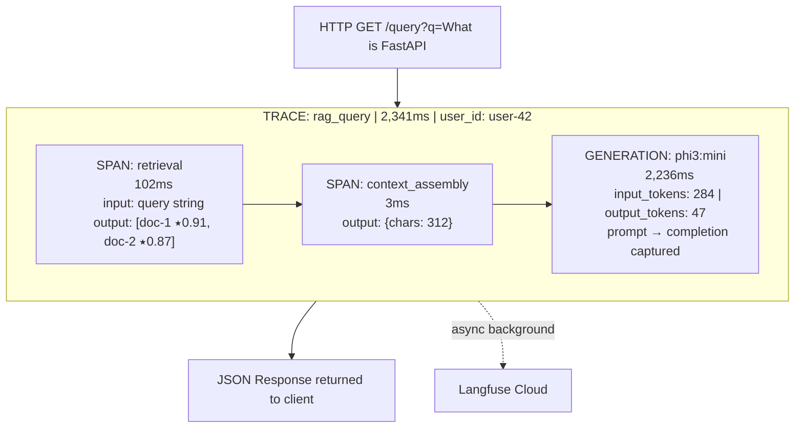
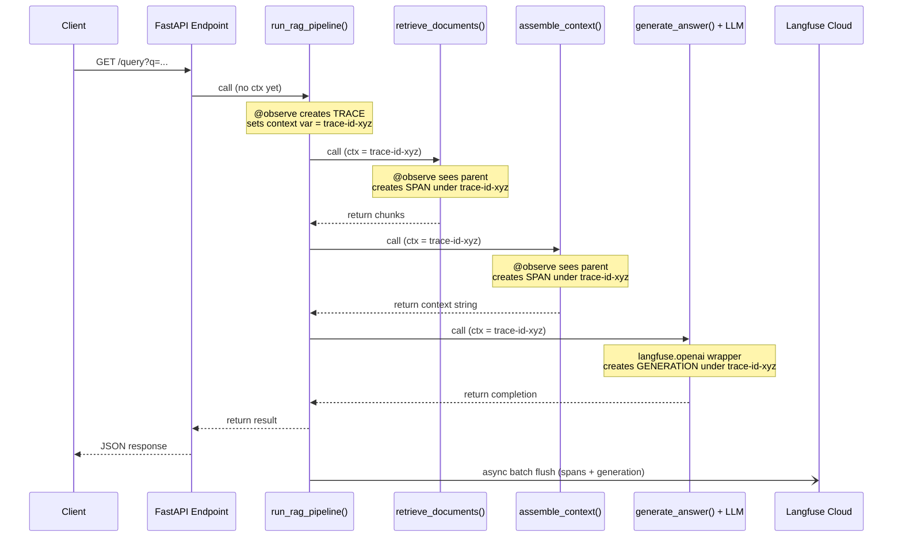

**Pillar 2 — Observability | Tier 1 | Run Locally**

> **Where you are:** Pre-Work and Pillar 1 are done. You have a FastAPI skeleton, Postgres, and Docker Compose running. Today you add the instrumentation layer that makes every LLM call visible, timed, and cost-attributed — in production and in dev.

---

## Session Goals

You're adding structured observability to a system you cannot debug with `console.log`. By the end of this session, Langfuse will show you every span in your RAG pipeline with timing, token counts, inputs, and outputs captured automatically on every request.

**The deliverable:** Hit `/query` and see a complete trace tree in `cloud.langfuse.com` — retrieval span, context-assembly span, LLM generation — all nested, all timed, all linked to a user ID.

---

## The 3 Concepts You Must Own After This Session

1. **Trace → Span → Generation hierarchy** — the three-level data model Langfuse uses, why each level exists, and what fields each carries.
2. **Trace propagation** — how a single HTTP request becomes a tree of nested child spans without you manually threading a correlation ID through every call.
3. **The `@observe` decorator pattern** — the idiomatic way to instrument Python functions without polluting business logic.

If someone asks "how does Langfuse tracing work?" and you cannot whiteboard the hierarchy in 60 seconds, redo this session before moving to 2.2.

---

## Why LLM Tracing Is Different From What You Know

### The Express Logging You're Used To

In Express you probably did something like:

```javascript
app.use((req, res, next) => {
  const start = Date.now();
  res.on('finish', () => {
    console.log(`${req.method} ${req.url} ${res.statusCode} — ${Date.now() - start}ms`);
  });
  next();
});
```

That tells you _a request completed_. It tells you nothing about:

- Which step inside your LLM pipeline was slow (retrieval? the LLM call? reranking?)
- How many tokens you consumed and what that cost
- What the model actually received vs. what it returned
- Whether output quality silently degraded since yesterday

### The New Failure Mode: Silent Degradation

LLM systems introduce a class of failure that classical observability misses entirely. The API returns `200`. The JSON looks fine. But the answer is wrong, or slower, or now costs 3× what it did last week. There is no exception to catch. No 500 status. The system is "working" and silently broken.

You need **traces**: structured records of causally linked operations, with timing, inputs, outputs, and costs, so you can answer:

|Question|What You Need|
|---|---|
|"Why was that request slow?"|Per-span timing|
|"What did the model actually receive?"|Prompt captured in the generation|
|"How much did that user cost us?"|Token counts + model pricing|
|"Did quality drop after we changed the prompt?"|Score attached to the trace|
|"Which retrieval chunk caused the hallucination?"|Retrieval span output|

This is the gap between **logging** ("a request came in") and **tracing** ("here is the complete causal story of this request").

---

## Langfuse Architecture

Langfuse is open-source LLM observability — think DataDog, purpose-built for LLM apps.

### Where It Sits in Your Stack

```
┌──────────────────────────────────────┐
│           Your FastAPI App           │
│                                      │
│   Langfuse SDK (async, background)  │
│   ─ batches spans                   │
│   ─ sends every ~1s                 │
│   ─ non-blocking, < 1ms overhead    │
└──────────────┬───────────────────────┘
               │  HTTPS (background thread)
               ▼
┌──────────────────────────────────────┐
│       Langfuse Cloud                 │
│       cloud.langfuse.com            │
│                                      │
│  ┌─────────────┐  ┌──────────────┐  │
│  │ Trace Store │  │ Dataset Store│  │ ← your golden eval sets (Pillar 11)
│  └─────────────┘  └──────────────┘  │
│  ┌─────────────┐                    │
│  │ Score Store │                    │ ← eval results (Pillar 11)
│  └─────────────┘                    │
└──────────────────────────────────────┘
```

**Hardware note:** You're using Langfuse Cloud free tier. Do **not** self-host Langfuse v3 locally — it requires 6 containers and will OOM your 8GB machine. Cloud free tier has no meaningful limits for personal projects.

---

## The Langfuse Data Model

Everything in Langfuse is an **observation**. Observations form a tree rooted at a **Trace**.

### The Three-Level Hierarchy

```
TRACE  (1 per user request — the root container)
  │
  ├── SPAN  (non-LLM work: retrieval, chunking, reranking, DB queries)
  │     ├── startTime / endTime  → duration
  │     ├── input               → what went in
  │     └── output              → what came out
  │
  ├── SPAN  (another unit of work...)
  │
  └── GENERATION  (special span for every LLM call)
        ├── model               → "phi3:mini", "gpt-4o-mini", etc.
        ├── usage.inputTokens   → prompt token count
        ├── usage.outputTokens  → completion token count
        ├── cost                → auto-calculated from model pricing
        ├── input               → the full prompt
        ├── output              → the full completion
        └── completionStartTime → enables TTFT calculation (Pillar 4)
```

### Visual: A Complete RAG Trace

```
┌─────────────────────────────────────────────────────────────────────────┐
│  TRACE: rag_query                                     total: 2,341ms    │
│  id: trc-abc123   user_id: user-42   tags: [rag, v1]                   │
│                                                                         │
│  ┌───────────────────────────────────────────────────────────────────┐  │
│  │  SPAN: retrieval                                       102ms      │  │
│  │  input:  { query: "What is FastAPI?" }                           │  │
│  │  output: [ {id: doc-1, score: 0.91}, {id: doc-2, score: 0.87} ] │  │
│  └───────────────────────────────────────────────────────────────────┘  │
│                                                                         │
│  ┌───────────────────────────────────────────────────────────────────┐  │
│  │  SPAN: context_assembly                                  3ms      │  │
│  │  output: { context_length_chars: 312, num_chunks: 2 }            │  │
│  └───────────────────────────────────────────────────────────────────┘  │
│                                                                         │
│  ┌───────────────────────────────────────────────────────────────────┐  │
│  │  GENERATION: openai (auto-captured by langfuse.openai wrapper)    │  │
│  │                                               2,236ms             │  │
│  │  model: phi3:mini                                                 │  │
│  │  input_tokens:  284   output_tokens: 47                           │  │
│  │  prompt:   "Answer the question using only the context below..."  │  │
│  │  completion: "FastAPI is a modern Python web framework that..."   │  │
│  └───────────────────────────────────────────────────────────────────┘  │
└─────────────────────────────────────────────────────────────────────────┘
```

### Mermaid Version (renders on GitHub)



---

## MERN → Langfuse Mental Model

|What you did in Express|Langfuse equivalent|
|---|---|
|`req.id` for request correlation|`trace.id` — auto-generated|
|`morgan` / `winston` request logger|One Langfuse trace per request|
|Middleware timing: `Date.now()` diff|Span `startTime` / `endTime` auto-captured|
|`console.log({ prompt, response })`|Generation `input` / `output` fields|
|Per-user request logs|Trace `userId` field|
|Datadog / Papertrail log aggregation|Langfuse Cloud UI|
|`express-async-errors` wrapping|`@observe` decorator wrapping|

The critical difference: Langfuse captures **structure**, not flat strings. You can filter traces by user, model, cost, latency percentile, or quality score. `console.log` can't do that.

---

## Core Concepts — Deep Dive

### Trace

The root container for one user interaction. Carries:

|Field|Purpose|
|---|---|
|`id`|Unique ID. Auto-generated or you set it. Use your request's `X-Request-ID` header for correlation.|
|`name`|What operation this is: `"rag_query"`, `"document_ingest"`, `"chat_turn"`|
|`userId`|Who made this request. Essential for per-user cost attribution (Pillar 2.2)|
|`sessionId`|Groups multiple traces into a conversation. One session = one chat thread|
|`tags`|Arbitrary labels: `["rag", "v1"]`, `["experiment-B"]`|
|`metadata`|Any JSON blob you want to attach|

**Rule:** One HTTP request → one trace. Always. Never create two traces for one request.

### Span

A unit of non-LLM work inside a trace. The key fields:

|Field|Purpose|
|---|---|
|`name`|What this step does: `"retrieval"`, `"reranking"`, `"chunking"`|
|`input`|What went in (serialized to JSON)|
|`output`|What came out|
|`startTime`|Auto-captured by `@observe`|
|`endTime`|Auto-captured when the function returns|
|`statusMessage`|Error message if the span failed|
|`level`|`"DEFAULT"` \| `"DEBUG"` \| `"WARNING"` \| `"ERROR"`|

Spans are **nested** — a span can have child spans. The nesting reflects your call stack. `retrieve_documents()` called from `handle_query()` becomes a child span under the `handle_query` trace automatically.

### Generation

A span specifically for LLM calls. Extends Span with:

|Field|Purpose|
|---|---|
|`model`|Which model: `"phi3:mini"`, `"gpt-4o-mini"`, `"claude-sonnet-4-6"`|
|`usage.inputTokens`|Prompt token count|
|`usage.outputTokens`|Completion token count|
|`usage.totalTokens`|Sum|
|`cost`|Auto-calculated from Langfuse's model pricing table|
|`completionStartTime`|Timestamp of first token — enables TTFT calculation|
|`promptName`|Links to versioned prompt in Langfuse (Pillar 2.4)|

Langfuse auto-calculates cost using `model + usage`. For Ollama (free/local), cost will show `$0.00` — that's correct. In Pillar 2.2 you'll learn to set custom cost rates for self-hosted models.

### Score

A quality signal attached to a trace. You'll create these in Pillars 11 and 2.5. For now: know they exist, and that every trace you create today is already set up to receive scores later.

---

## Trace Propagation — The Hard Part

### The Problem

Your RAG pipeline is a chain of function calls:

```
handle_query()
  └── retrieve_documents()
  └── assemble_context()
  └── generate_answer()
```

How does Langfuse know that `retrieve_documents()` and `generate_answer()` belong to the _same_ trace? In Express you'd pass `req.correlationId` through every function. In Langfuse, you use Python's `contextvars` — the SDK propagates the trace context automatically through the call stack.

### How `@observe` Propagates Context

```
@observe(name="rag_query")           ← Creates TRACE, sets context var
def handle_query(query):
    docs = retrieve_documents(query)  ─┐
    context = assemble_context(docs)   │ These functions run INSIDE
    answer = generate_answer(context)  │ the context created above
    return answer                     ─┘

@observe(name="retrieval")           ← Creates SPAN, reads context var
def retrieve_documents(query):       ← Automatically nested under rag_query
    ...

@observe(name="context_assembly")    ← Creates SPAN, reads context var
def assemble_context(docs):          ← Automatically nested under rag_query
    ...
```

The `@observe` decorator:

1. On entry: reads the current context var (is there a parent trace/span?)
2. If parent found: creates a child span and links it
3. If no parent: creates a new root trace
4. On exit: closes the span with `endTime`
5. On exception: marks span as `ERROR` with the traceback

### Mermaid: Context Propagation Flow



---

## Lab Setup

### Prerequisites Check

Before starting, verify your environment is ready:

```bash
# 1. Portfolio FastAPI app responds
curl http://localhost:8000/health
# Expected: 200 OK (or whatever your health endpoint returns)

# 2. Docker services running (you should only have 2-3 active)
docker stats --no-stream
# Expected: FastAPI container + Postgres container

# 3. Ollama is installed and phi3:mini is pulled
ollama list
# Expected: NAME          ID        SIZE    MODIFIED
#           phi3:mini     ...       2.2 GB  ...
# If phi3:mini not listed: ollama pull phi3:mini

# 4. Ollama server is running
curl http://localhost:11434/api/tags
# Expected: JSON with model list

# 5. You're in your virtual environment
which python
# Expected: /home/you/.pyenv/versions/.../bin/python (or similar pyenv path)
```

If any check fails, fix it before proceeding. Don't start the lab with a broken environment.

---

### Step 1 — Langfuse Cloud Account

1. Go to [https://cloud.langfuse.com](https://cloud.langfuse.com/)
2. Sign up (GitHub OAuth is fastest)
3. Create a new project — name it `ai-infra-portfolio`
4. Go to **Settings → API Keys**
5. Click **Create new API key**
6. Copy both keys immediately (you won't see the secret key again)

Add to your portfolio project's `.env`:

```dotenv
# Langfuse Cloud
LANGFUSE_PUBLIC_KEY=pk-lf-xxxxxxxxxxxxxxxxxxxxxxxxxxxxxxxx
LANGFUSE_SECRET_KEY=sk-lf-xxxxxxxxxxxxxxxxxxxxxxxxxxxxxxxx
LANGFUSE_HOST=https://cloud.langfuse.com
```

Verify `.env` is in your `.gitignore`:

```bash
grep ".env" .gitignore
# Must output: .env
# If missing: echo ".env" >> .gitignore
```

Never commit API keys. This is the same rule as in Express. Same stakes.

---

### Step 2 — Install Dependencies

```bash
pip install "langfuse>=3.0.0" "openai>=1.0.0"
```

Add to `requirements.txt`:

```
langfuse>=3.0.0
openai>=1.0.0
```

Why `openai`? Langfuse's LLM auto-instrumentation wraps the OpenAI Python SDK. Since Ollama exposes an OpenAI-compatible HTTP API at `http://localhost:11434/v1`, you get free auto-instrumentation of local model calls with zero extra code.

> **SDK version note:** `langfuse>=3.0.0` resolves to whatever the current major is — as of this writing that's **Python SDK v4**, built on OpenTelemetry with an _observation-centric_ data model (attributes like `user_id` propagate to every observation, not just the trace root). Every code sample in this session targets v4: `from langfuse import observe, get_client, propagate_attributes`. Run `pip show langfuse` after installing — if it reports a major version below 4, the import paths below won't match and you should check [the upgrade path docs](https://langfuse.com/docs/observability/sdk/upgrade-path) for what changed.

---

### Step 3 — Startup Verification Utility

**Load `.env` before anything else touches Langfuse.** `get_client()` is a singleton — it reads `LANGFUSE_PUBLIC_KEY`/`LANGFUSE_SECRET_KEY` from the environment the _first_ time it's called anywhere in the app, including at module-import time (e.g. `langfuse = get_client()` at the top of `rag_pipeline.py`). FastAPI/uvicorn does **not** auto-load `.env` files — you must call `load_dotenv()` explicitly, before any other app module is imported. Get this ordering wrong and the client locks in as disabled for the life of the process — setting the env vars correctly won't fix an already-initialized singleton.

```bash
pip install python-dotenv   # skip if already installed from Pre-Work
```

Create `app/instrumentation.py`:

```python
"""
Langfuse initialization and startup health check.
Import this module once at app startup.
"""
from langfuse import get_client  # v4 — returns the global singleton configured from env vars


def verify_langfuse_connection() -> bool:
    """
    Call at startup. Returns True if connection OK, False otherwise.

    IMPORTANT: auth_check() does NOT raise on failure — it logs internally
    and returns False. Checking only for an exception (as an earlier version
    of this function did) silently prints success even when auth failed.
    Always check the return value.
    """
    client = get_client()
    ok = client.auth_check()

    if ok:
        print("✓ Langfuse connected — traces will appear in cloud.langfuse.com")
    else:
        print("✗ Langfuse auth check failed — check LANGFUSE_PUBLIC_KEY, ")
        print("  LANGFUSE_SECRET_KEY, and LANGFUSE_HOST in .env")
        print("  → Requests will still be served; traces will be lost")

    return ok
```

Wire into `app/main.py` — **`load_dotenv()` must be the first executable line, before any `app.*` import**, since importing `app.rag_pipeline` triggers its module-level `get_client()` call:

```python
from dotenv import load_dotenv
load_dotenv()  # MUST run before importing anything that touches Langfuse

from contextlib import asynccontextmanager
from fastapi import FastAPI
from app.instrumentation import verify_langfuse_connection


@asynccontextmanager
async def lifespan(app: FastAPI):
    # Startup
    verify_langfuse_connection()
    yield
    # Shutdown (nothing to clean up — Langfuse SDK flushes on process exit)


app = FastAPI(lifespan=lifespan)
```

Restart your app **fully** (stop uvicorn, don't rely on `--reload` — a stale disabled singleton can persist across a hot-reload in some cases). You should see `✓ Langfuse connected` in the terminal. If you see the failure message:

- Confirm `.env` sits in the same directory you run `uvicorn` from (check with `Get-ChildItem -Force` in PowerShell — Notepad silently saves as `.env.txt` on Windows if "hide file extensions" is on).
- Confirm the key names match exactly: `LANGFUSE_PUBLIC_KEY`, `LANGFUSE_SECRET_KEY`, `LANGFUSE_HOST`.
- Confirm no quotes around the values in `.env` (`LANGFUSE_HOST=https://cloud.langfuse.com`, not `LANGFUSE_HOST="https://cloud.langfuse.com"`).

---

### Step 4 — Instrumented LLM Client

Create `app/llm_client.py`:

```python
"""
LLM client — uses langfuse.openai as a drop-in replacement for openai.OpenAI.
Every call to client.chat.completions.create() is automatically logged
as a Generation in Langfuse with token counts, model name, and full prompt/completion.
"""
from langfuse.openai import openai  # ← wraps the entire openai module, not a class

# Ollama's OpenAI-compatible endpoint
OLLAMA_BASE_URL = "http://localhost:11434/v1"

client = openai.OpenAI(
    base_url=OLLAMA_BASE_URL,
    api_key="ollama",  # Ollama ignores this; SDK requires a non-empty string
)

# Default model for local inference
DEFAULT_MODEL = "phi3:mini"
```

**What this replaces conceptually:**

```javascript
// Express: You'd import the raw SDK
import OpenAI from "openai";
const client = new OpenAI({ apiKey: process.env.OPENAI_API_KEY });

// Langfuse equivalent: swap the import, keep everything else identical
from langfuse.openai import openai  # ← wraps the module; access OpenAI via openai.OpenAI(...)
client = openai.OpenAI(...)
```

Zero other code changes needed. The wrapper intercepts every `.create()` call, captures the request and response, and ships a Generation span to Langfuse.

---

### Step 5 — Build the Mock RAG Pipeline with 3 Spans

At this stage (before Pillar 10), you don't have Qdrant. The retrieval step is mocked with hardcoded chunks. This is intentional: you're testing the _instrumentation structure_, not the retrieval quality. Pillar 10 replaces this mock with real Qdrant.

Create `app/rag_pipeline.py`:

```python
"""
Mock RAG pipeline — 3 observable stages.
Real retrieval (Qdrant) arrives in Pillar 10; instrumentation structure stays the same.

Built against Langfuse Python SDK v4 (observation-centric data model).
"""
import time
from langfuse import observe, get_client, propagate_attributes
from app.llm_client import client, DEFAULT_MODEL

langfuse = get_client()  # shared singleton, configured from .env — do not construct Langfuse() yourself


# ─────────────────────────────────────────────────────────────────────────────
# SPAN 1: Document Retrieval
# ─────────────────────────────────────────────────────────────────────────────

@observe(name="retrieval")
def retrieve_documents(query: str) -> list[dict]:
    """
    Mock retrieval. Returns hardcoded chunks to validate trace structure.
    Pillar 10 replaces this body with:
        results = qdrant_client.search(collection_name="docs", query_vector=..., limit=5)
    The @observe decorator and langfuse.update_current_span() calls stay unchanged.
    """
    # Simulate network/IO latency (~100ms for a Qdrant call)
    time.sleep(0.1)

    mock_chunks = [
        {
            "id": "doc-001",
            "text": "FastAPI is a modern, high-performance Python web framework built on Starlette.",
            "score": 0.91,
        },
        {
            "id": "doc-002",
            "text": "Pydantic v2 handles data validation using Python type annotations.",
            "score": 0.87,
        },
        {
            "id": "doc-003",
            "text": "Docker containers package applications with all their dependencies.",
            "score": 0.72,
        },
    ]

    # Attach output + metadata to THIS span (not the trace root).
    # update_current_span() writes to whichever observation @observe created
    # for the currently executing function.
    langfuse.update_current_span(
        output=mock_chunks,
        metadata={
            "num_chunks": str(len(mock_chunks)),
            "top_score": str(mock_chunks[0]["score"]),
            "retrieval_backend": "mock_v0",  # Update to "qdrant" in Pillar 10
        },
    )

    return mock_chunks


# ─────────────────────────────────────────────────────────────────────────────
# SPAN 2: Context Assembly
# ─────────────────────────────────────────────────────────────────────────────

@observe(name="context_assembly")
def assemble_context(chunks: list[dict]) -> str:
    """
    Concatenates retrieved chunks into the context string injected into the prompt.
    Chunking strategies (overlap, sliding window) are covered in Pillar 10.2.
    """
    context_parts = [f"[Source: {c['id']}]\n{c['text']}" for c in chunks]
    context = "\n\n---\n\n".join(context_parts)

    langfuse.update_current_span(
        output={
            "context_length_chars": len(context),
            "num_sources": len(chunks),
        }
    )

    return context


# ─────────────────────────────────────────────────────────────────────────────
# GENERATION: LLM Answer (no @observe needed — langfuse.openai handles it)
# ─────────────────────────────────────────────────────────────────────────────

def generate_answer(query: str, context: str) -> str:
    """
    Calls the LLM. The langfuse.openai wrapper auto-captures:
    - Full prompt and completion
    - Token counts (input + output)
    - Model name
    - Latency (including TTFT if streaming)
    No manual instrumentation needed here. Because this call happens inside the
    propagate_attributes() block in run_rag_pipeline (below), the generation it
    creates automatically inherits user_id/tags/metadata too.
    """
    prompt = (
        "Answer the question using ONLY the provided context. "
        "If the context does not contain enough information, say so. "
        "Be concise — 2-3 sentences maximum.\n\n"
        f"Context:\n{context}\n\n"
        f"Question: {query}\n\n"
        "Answer:"
    )

    response = client.chat.completions.create(
        model=DEFAULT_MODEL,
        messages=[{"role": "user", "content": prompt}],
        max_tokens=256,
        temperature=0.1,  # Low temp for factual retrieval tasks
    )

    return response.choices[0].message.content.strip()


# ─────────────────────────────────────────────────────────────────────────────
# ROOT SPAN: Full Pipeline Orchestrator
# ─────────────────────────────────────────────────────────────────────────────

@observe(name="rag_query")
def run_rag_pipeline(query: str, user_id: str = "anonymous") -> dict:
    """
    @observe() creates the root span for this trace. propagate_attributes()
    pushes user_id/tags/metadata onto every child observation created inside
    the `with` block — retrieval, context_assembly, and the LLM generation
    all inherit them. This is what makes per-user cost attribution possible
    in Pillar 2.2.
    """
    with propagate_attributes(
        user_id=user_id,
        tags=["rag", "v1", "mock-retrieval"],
        metadata={
            "pipeline_version": "2.1",
            "query_length": str(len(query)),  # propagated metadata must be dict[str, str]
        },
    ):
        # Stage 1: Retrieve
        chunks = retrieve_documents(query)

        # Stage 2: Build context string
        context = assemble_context(chunks)

        # Stage 3: Generate — auto-instrumented by langfuse.openai wrapper
        answer = generate_answer(query, context)

    # Trace input/output default to the root observation's input/output, so
    # setting the root span's output here also sets the trace output shown
    # in the Langfuse UI.
    langfuse.update_current_span(
        output={"answer_length": len(answer), "chunks_used": len(chunks)}
    )

    return {
        "query": query,
        "answer": answer,
        "sources": [c["id"] for c in chunks],
        "chunks_retrieved": len(chunks),
    }
```

---

### Step 6 — Wire Into the FastAPI Endpoint

In `app/main.py` (or `app/routes/query.py` if you've modularised):

```python
from fastapi import FastAPI, Query as QueryParam
from app.rag_pipeline import run_rag_pipeline

# ... (lifespan and app definition from Step 3) ...

@app.get("/query")
async def query_endpoint(
    q: str = QueryParam(..., min_length=3, description="User query string"),
    user_id: str = QueryParam(default="anonymous", description="User identifier for cost attribution"),
):
    """
    RAG query endpoint.
    Every request creates one Langfuse trace with three child observations.
    """
    result = run_rag_pipeline(query=q, user_id=user_id)
    return result


@app.get("/health")
async def health():
    return {"status": "ok"}
```

**Important:** `run_rag_pipeline` is a sync function called from an async endpoint. This is fine for the lab — FastAPI runs sync route handlers in a thread pool automatically. In production you'd make the pipeline async (covered when you add real Qdrant I/O). The `@observe` decorator supports both sync and async functions.

---

### Step 7 — Run and Send Test Queries

```bash
# Terminal 1 — Ollama must be running
ollama serve

# Terminal 2 — Start your FastAPI app
uvicorn app.main:app --reload --port 8000

# Terminal 3 — Send test queries
curl -s "http://localhost:8000/query?q=What+is+FastAPI&user_id=test-user-1" | python -m json.tool

curl -s "http://localhost:8000/query?q=What+does+Pydantic+do&user_id=test-user-2" | python -m json.tool

curl -s "http://localhost:8000/query?q=How+do+Docker+containers+work&user_id=test-user-1" | python -m json.tool

# Send 5 more queries with different questions and user IDs
# You want at least 8 traces before opening the Langfuse UI
```

Ollama on CPU with Phi-3 mini is slow (~20–40 tokens/sec). Each request will take 10–30 seconds. This is expected. The traces are still valid for inspection.

---

### Step 8 — Verify in the Langfuse UI

Go to [https://cloud.langfuse.com](https://cloud.langfuse.com/) → your project → **Traces** tab.

#### UI Verification Checklist

Work through every item. Do not move to 2.2 until all are checked.

- [ ] Each query created **exactly one top-level trace** (no duplicate roots)
- [ ] Each trace is named `rag_query`
- [ ] Each trace shows **3 observations** in the tree: `retrieval`, `context_assembly`, one generation
- [ ] The `retrieval` span shows **~100ms latency** (the mock sleep)
- [ ] The `context_assembly` span shows **< 5ms latency** (pure string ops)
- [ ] The generation shows **model: phi3:mini**, **input_tokens > 0**, **output_tokens > 0**
- [ ] Clicking the generation shows **the full prompt text** and **the full completion**
- [ ] The `user_id` field is populated (click into a trace → trace details)
- [ ] The total trace latency approximately equals `retrieval + context_assembly + generation` (any gap > 100ms indicates uninstrumented work between steps)
- [ ] Traces from `test-user-1` and `test-user-2` appear separately and are filterable

If the generation shows `input_tokens: 0` or `output_tokens: 0`, your Ollama endpoint isn't returning token usage. Add `"stream": False` explicitly to your `.create()` call.

---

### Step 9 — Manual Flush Verification (For Tests)

The SDK flushes asynchronously. In long-running apps this is handled automatically. In scripts and pytest, always flush manually or data is lost:

```python
# Add this to any standalone script or pytest teardown
from langfuse import get_client
langfuse = get_client()  # same shared singleton the pipeline used — not a new instance

# ... your pipeline calls ...

langfuse.flush()  # Block until all pending spans are sent
```

Test it:

```python
# test_instrumentation.py
from app.rag_pipeline import run_rag_pipeline
from langfuse import get_client

def test_pipeline_creates_trace():
    result = run_rag_pipeline("What is Docker?", user_id="pytest")
    assert "answer" in result
    assert result["chunks_retrieved"] == 3

    # Always flush in tests — data is batched and won't appear without this
    langfuse = get_client()
    langfuse.flush()
    # Check cloud.langfuse.com — the pytest trace should appear within 5 seconds

# Run: pytest test_instrumentation.py -v
```

---

## Common Failure Mode: Client Disabled — Auth Error at Startup

**Symptom:** Terminal shows repeated lines like:

```
Authentication error: Langfuse client initialized without public_key. Client will be disabled.
Auth check failed: Client not properly initialized. Error: Langfuse client is not initialized
Context error: No active span in current context. Operations that depend on an
active span will be skipped.
```

...and requests still return `200 OK`, but nothing appears in `cloud.langfuse.com`.

**Root Cause:** `get_client()` is a singleton that reads `LANGFUSE_PUBLIC_KEY`/`LANGFUSE_SECRET_KEY` from the environment the _first_ time it's called anywhere in the process. If any app module runs `get_client()` at import time (e.g. `rag_pipeline.py`'s module-level `langfuse = get_client()`) before `load_dotenv()` has populated the environment, the client locks in as disabled — permanently, for that process. The "Context error: No active span" lines are the downstream symptom: since the client is disabled, `@observe` never actually creates a real span, so `update_current_span()` has nothing to attach to.

**Fix:** `load_dotenv()` must be the first executable line in `app/main.py`, before any `from app.* import ...` statement. See Step 3 above.

**Diagnose in 30 seconds:**

```python
# Run this as a standalone script BEFORE touching FastAPI, from your project root
from dotenv import load_dotenv
load_dotenv()
import os
print("PUBLIC_KEY set:", bool(os.getenv("LANGFUSE_PUBLIC_KEY")))
print("SECRET_KEY set:", bool(os.getenv("LANGFUSE_SECRET_KEY")))
print("HOST:", os.getenv("LANGFUSE_HOST"))
```

If any of these print `False` or `None`, the `.env` file isn't being found or the key names don't match exactly. Check the file is named `.env` (not `.env.txt`) and sits in the directory you run `uvicorn` from.

---

**Symptom:** In the Langfuse UI you see 3 separate top-level traces instead of one trace with 3 child observations. The `retrieval`, `context_assembly`, and generation appear as root traces, not children of `rag_query`.

**What this looks like:**

```
✗ WRONG — what you don't want:
Traces list:
  rag_query      (trace)
  retrieval      (trace) ← should be a span INSIDE rag_query
  context_assembly (trace) ← should be a span INSIDE rag_query
  openai         (trace) ← should be a generation INSIDE rag_query

✓ CORRECT — what you want:
Traces list:
  rag_query (trace)
    └── retrieval (span)
    └── context_assembly (span)
    └── openai (generation)
```

**Root Cause:** `@observe` propagates trace context through OpenTelemetry's context vars, which are bound to the executing thread/task. This breaks at a thread boundary — most commonly `asyncio.to_thread()` or a bare `ThreadPoolExecutor` that doesn't copy the OTEL context into the new thread.

**Diagnose in 30 seconds:**

```python
# Add this line inside each @observe function temporarily:
from langfuse import get_client
langfuse = get_client()
print(f"TRACE ID in {__name__}: {langfuse.get_current_trace_id()}")
```

All three functions must print the **same trace ID**. If they differ, context propagation broke.

**Common causes and fixes:**

```python
# ── CAUSE 1: Thread pool breaks contextvars ─────────────────────────────────

# ✗ BREAKS context (asyncio.to_thread creates a new thread)
@app.get("/query")
async def query_endpoint(q: str):
    result = await asyncio.to_thread(run_rag_pipeline, q)
    return result

# ✓ WORKS — sync function called directly from async (FastAPI handles the thread)
@app.get("/query")
async def query_endpoint(q: str):
    result = run_rag_pipeline(q)
    return result


# ── CAUSE 2: Constructing a new Langfuse() instance in a child function ─────

# ✗ AVOID — bypasses the shared singleton the rest of your app uses
@observe(name="retrieval")
def retrieve_documents(query: str):
    lf = Langfuse()  # ← don't construct a new client inside child functions
    ...

# ✓ WORKS — use the shared singleton everywhere via get_client()
@observe(name="retrieval")
def retrieve_documents(query: str):
    langfuse = get_client()
    langfuse.update_current_span(output={"docs": [...]})


# ── CAUSE 3: @observe missing on the root function ──────────────────────────

# ✗ No root trace — child spans have nothing to attach to
def run_rag_pipeline(query: str):  # ← missing @observe
    docs = retrieve_documents(query)
    ...

# ✓ Root function MUST have @observe
@observe(name="rag_query")
def run_rag_pipeline(query: str):
    ...
```

---

## Directory Structure After This Session

Your portfolio project should look like this:

```
ai-infra-portfolio/
├── app/
│   ├── __init__.py
│   ├── main.py              ← FastAPI app with lifespan + /query endpoint
│   ├── instrumentation.py   ← NEW: Langfuse init + startup check
│   ├── llm_client.py        ← NEW: instrumented OpenAI client → Ollama
│   └── rag_pipeline.py      ← NEW: 3-span mock RAG pipeline
├── .env                     ← Langfuse keys added (never committed)
├── .gitignore               ← .env listed
├── requirements.txt         ← langfuse>=3.0.0, openai>=1.0.0, python-dotenv added
└── docker-compose.yml       ← unchanged (FastAPI + Postgres, mem_limit: 1g each)
```

---

## What NOT to Do

|Temptation|Why It's Wrong|
|---|---|
|Add `@observe` to every tiny helper function|Noise in the UI. Only instrument meaningful stages.|
|Construct a new `Langfuse()` instance instead of using `get_client()`|Bypasses the shared singleton. Use `get_client()` everywhere.|
|Call `langfuse.flush()` after every request in production|Blocks the response thread. Flush is for tests and scripts only.|
|Skip the UI verification checklist|You won't catch detached spans until 2.2 when the cost data is wrong.|
|Self-host Langfuse v3 locally|6 containers, >6GB RAM. Use Cloud free tier.|

---

## Evening Integration — Before You Close the Laptop

```bash
# 1. Verify all new files are present
ls app/

# 2. Run a final end-to-end test
curl "http://localhost:8000/query?q=Explain+Docker+volumes&user_id=final-test"

# 3. Confirm trace appears in cloud.langfuse.com (< 10 seconds after request)

# 4. Commit
git add app/instrumentation.py app/llm_client.py app/rag_pipeline.py \
        app/main.py requirements.txt .gitignore
git commit -m "[pillar-2.1] add langfuse tracing — 3-span rag pipeline (retrieval, context_assembly, generation)"
git push
```

**3-sentence journal (write it, don't skip it):**

1. What you built today and what it does
2. What broke and the exact error / symptom
3. What you'd do differently if starting over

---

## Commit Message

```
[pillar-2.1] add langfuse tracing — 3-span rag pipeline (retrieval, context_assembly, generation)
```

---

## Preview: What 2.2 Builds Directly On This

In **Session 2.2 (Cost-Per-Request Dashboards)** you will:

- Pull token counts from the generation spans you created today
- Add per-user cost attribution using the `userId` already set up
- Build a Langfuse dashboard query that shows cost broken down by `user_id`
- Set a budget alert that fires when daily cost exceeds a threshold

The `user_id`, `tags`, and `metadata` fields you set via `propagate_attributes()` today are exactly what 2.2 queries against. You already built the data foundation. The dashboard is the next layer.

---

## Quick Reference Card

```
TRACE       = one user request (root observation and everything nested under it)
SPAN        = one unit of non-LLM work (an observation)
GENERATION  = one LLM call (an observation, as_type="generation")

from langfuse import observe, get_client, propagate_attributes
langfuse = get_client()                         → shared singleton, env-configured

@observe(name="x")                              → auto-creates a span; root call = trace root
with propagate_attributes(user_id=.., tags=.., metadata={...}):
                                                 → pushes attrs onto every child observation
langfuse.update_current_span(output=.., metadata=..)        → set data on current span
langfuse.update_current_generation(output=.., usage_details=..) → set data on current generation
from langfuse.openai import openai              → openai.OpenAI(...) auto-instruments .create()
langfuse.flush()                                → use in tests/scripts only, not per-request in prod

CONTEXT BREAKS AT: thread boundaries (asyncio.to_thread, bare ThreadPoolExecutor)
DIAGNOSE WITH:     print(langfuse.get_current_trace_id()) in each @observe function — must match
AVOID:             constructing Langfuse() directly — use get_client() everywhere
```