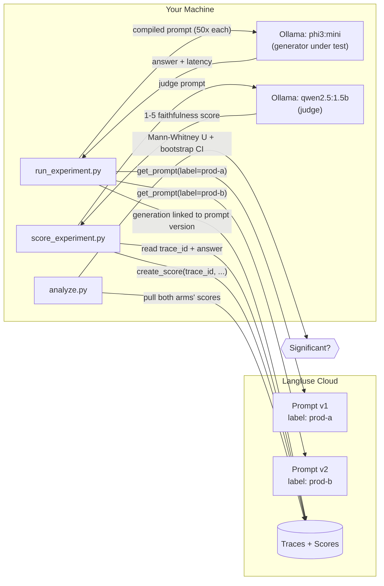

**Pillar 2 — Observability (Tier 1) · Week 3–4 · Local** **Prereqs:** 2.1 (Langfuse tracing wired up), 2.3 (latency spans), Ollama running with `phi3:mini` + `qwen2.5:1.5b` pulled

---

## 1. Session Goal

Treat prompts like code: every change gets a version, a label, and a measurable outcome instead of an overwrite. You'll ship two competing versions of the same prompt behind labels, run 50 requests through each, score the outputs with a second model acting as judge, and run an actual significance test on the result — not eyeballing "this one looks better."

---

## 2. The 3 Things You Should Be Able to Explain After This

1. **Why prompts need version control at all** — and the exact mechanism Langfuse uses (immutable versions + mutable label pointers) to let you roll forward and back without redeploying code.
2. **How label-based A/B routing works in production** — fetch-by-label, random assignment, and why the generation must be _linked_ to the prompt version for the comparison to mean anything later.
3. **Why n=50 per arm is a real statistical constraint, not a rounding error** — what a p-value can and can't tell you at that sample size, and what to report instead of just "significant / not significant."

---

## 3. A Note Before You Start: What You're Actually Testing

You're about to see `phi3:mini` — a 3.8B model running on your CPU — give clumsy answers sometimes. That is **not** what this lab measures.

This lab isolates one variable: _does changing the prompt's instructions measurably change the model's behavior, for the same fixed model, on the same fixed inputs?_ That's an infrastructure question — can your pipeline detect a real behavioral shift from a prompt change — not a model-quality question. A senior engineer runs this exact experiment against GPT-4o, Llama, or phi3:mini with identical code. The harness doesn't care which model is behind the label.

---

## 4. MERN Bridge

|MERN / npm world|Langfuse prompt management|
|---|---|
|`npm publish` bumps `package.json` version on every publish|`create_prompt()` auto-increments the version on every call, even with identical text|
|`npm dist-tag add pkg@1.2.0 next`|`update_prompt(name=..., version=1, new_labels=["prod-a"])`|
|`require('pkg')` resolves the `latest` dist-tag by default|`get_prompt(name)` with no label resolves the `production` label by default|
|Feature-flag % rollout (LaunchDarkly, or a hand-rolled Express middleware bucketing by `req.headers['x-user-id']`)|`random.choice([prompt_a, prompt_b])` at request time, tracked via labels|
|Jest snapshot diff (`--updateSnapshot`)|Langfuse's prompt version diff view in the UI|
|npm registry cache serving a stale patch for a few seconds after publish|Langfuse SDK's client-side prompt cache (default 60s TTL) — see §8, this **will** bite you|

```
npm dist-tags                          Langfuse prompt labels
──────────────────                     ──────────────────────
npm publish                            create_prompt(name="x", prompt=...)
  (new version, e.g. 1.2.0 → 1.2.1)      (new version, e.g. v1 → v2)

npm dist-tag add x@1.2.0 next          update_prompt(name="x", version=1,
                                            new_labels=["prod-a"])

require('x')                           get_prompt("x")
  → resolves 'latest' by default         → resolves label "production" by default

require('x/next')                      get_prompt("x", label="prod-a")
  → explicit tag                         → explicit label
```

---

## 5. Architecture — What You're Building



Three scripts, run in order: generate → judge → analyze. Each writes to a local JSON file so the next step doesn't need to re-derive anything.

---

## 6. Langfuse API — Verified Current (SDK v4, July 2026)

**Read this before you write any code.** Langfuse's Python SDK went through a major rewrite (v4, released March 2026) that changed how tracing and prompt-linking work — this is exactly the kind of "confirm before assuming" case flagged in your curriculum's content rules. The syntax below is pulled from Langfuse's current official docs, not memory. If you land on this session after another major version bump, check `https://langfuse.com/docs/observability/sdk/upgrade-path` first — don't debug a v5 error against v4 syntax.

**Install:**

```bash
pip install "langfuse>=4.0.0,<5.0.0" python-dotenv scipy numpy requests --break-system-packages
```

Pin the major version explicitly. `langfuse` requires Python ≥3.10, which your pyenv setup already satisfies.

**Env vars — `.env` in your project root:**

```bash
LANGFUSE_PUBLIC_KEY=pk-lf-...
LANGFUSE_SECRET_KEY=sk-lf-...
LANGFUSE_BASE_URL=https://cloud.langfuse.com
```

`LANGFUSE_BASE_URL` is the current preferred variable name (the older `LANGFUSE_HOST` still works for backward compatibility, but new docs use `LANGFUSE_BASE_URL` — use that). `load_dotenv()` **must run before** `get_client()` — the client is a singleton that reads env vars at first call, same rule as every other credentialed client in this curriculum.

**Core calls you'll use today:**

```python
from langfuse import get_client
langfuse = get_client()          # singleton, reads env vars at first call

# Create/version a prompt — a new call with the same name = a new version
langfuse.create_prompt(
    name="policy-qa-answer",
    type="text",                  # single string; use "chat" for role arrays
    prompt="...{{context}}...{{question}}...",
    labels=["prod-a"],
)

# Fetch by label (not by hardcoded version — that's the whole point)
prompt = langfuse.get_prompt("policy-qa-answer", label="prod-a")

# Fill in the template
compiled_text = prompt.compile(context=CONTEXT, question=question)

# Link a generation to the prompt version that produced it
with langfuse.start_as_current_observation(
    as_type="generation",
    name="policy-qa-prod-a",
    model="phi3:mini",
    input={"question": question},
    prompt=prompt,                # <-- this is what makes per-version metrics possible
) as generation:
    output = call_model(compiled_text)
    generation.update(output=output)
    trace_id = generation.trace_id   # grab this now, you'll need it to attach a score later

# Attach a score to a trace after the fact (e.g. from a separate judge pass)
langfuse.create_score(
    trace_id=trace_id,
    name="faithfulness",
    value=4,
    data_type="NUMERIC",
    comment="judged by qwen2.5:1.5b",
)

langfuse.flush()   # short-lived scripts: call this before exit or you'll lose buffered events
```

One SDK behavior worth knowing since it affects how you write error handling: `get_prompt()` **raises** (`LangfuseNotFoundError`) if the name/label doesn't exist — it does not silently return `None`. That's different from some other Langfuse SDK methods (e.g. `auth_check()`) that log internally and return `False` instead of raising. A bare `try/except LangfuseNotFoundError` around `get_prompt()` is a correct pattern here.

---

## 7. Lab

### 7.0 — Before you start

```bash
ollama list                 # confirm phi3:mini and qwen2.5:1.5b are both present
cat .env                    # confirm LANGFUSE_PUBLIC_KEY / SECRET_KEY / BASE_URL are set
```

You don't need Docker running for this lab — no Postgres, no FastAPI container. It's Ollama + Langfuse Cloud only. That matters for RAM: `phi3:mini` (2.2GB) plus the Windows baseline (~1.5GB) leaves roughly 2.2GB of headroom on your 5.92GB usable. When you get to the judge step, Ollama will typically have already evicted `phi3:mini` from memory (default `keep_alive` is 5 minutes idle), but check before you start step 7.3:

```bash
ollama ps                   # see what's currently resident
ollama stop phi3:mini       # force-unload it if it's still sitting there
```

Project layout for this session:

```
prompt-ab-test/
├── .env
├── policy_doc.py            # shared context + question set
├── seed_prompts.py          # step 1
├── run_experiment.py        # step 2
├── score_experiment.py      # step 3
└── analyze.py                # step 4
```

### 7.1 — `policy_doc.py` (shared by all scripts)

A fixed synthetic "document" stands in for real retrieval here — Qdrant and real chunking don't show up until Pillar 10. Two of the ten questions are deliberately **not answerable from the document**, to test whether the stricter prompt variant actually refuses instead of guessing.

```python
# policy_doc.py

CONTEXT = """Northwind Traders Remote Work Policy (v3, effective March 2026):
Employees may work remotely up to 3 days per week, subject to manager approval
submitted at least 5 business days in advance. Employees working remotely must
be reachable via Slack during core hours, 10 AM-4 PM in their local time zone.
The company provides a one-time home-office stipend of ₹15,000, claimable
within the first 90 days of employment or role change. Internet reimbursement
is capped at ₹1,200/month with a submitted bill. Employees relocating outside
their home city for more than 30 consecutive days must notify HR and Payroll
at least 2 weeks beforehand for tax-residency purposes. Laptops remain company
property and must be returned within 10 business days of resignation or
termination. The policy is reviewed annually by the People Operations team
every January."""

QUESTIONS = [
    "How many days per week can employees work remotely?",
    "How far in advance must remote work be approved by a manager?",
    "What are the core hours employees must be reachable on Slack?",
    "How much is the one-time home-office stipend?",
    "Within how many days of starting a new role must the stipend be claimed?",
    "What is the monthly cap on internet reimbursement?",
    "If an employee relocates for more than 30 days, who must they notify and how far in advance?",
    "How many business days does an employee have to return their laptop after resignation?",
    "What is the company's policy on annual bonuses?",              # NOT in the doc
    "Does the company cover relocation costs for permanent moves?",  # NOT in the doc
]

PROMPT_NAME = "policy-qa-answer"
REPEATS_PER_QUESTION = 5   # 10 questions x 5 repeats = 50 calls per prompt variant
```

### 7.2 — `seed_prompts.py` — push both variants

The two variants are a real, testable contrast: **A** is a plain instruction, **B** forces the model to quote its source before answering and gives it an explicit refusal script for out-of-scope questions. This is the anti-hallucination pattern you'll formalize properly in Pillar 11's behavioral tests — here you're just measuring whether it moves the needle.

```python
# seed_prompts.py
from dotenv import load_dotenv
load_dotenv()                      # must run before get_client()

from langfuse import get_client
from policy_doc import PROMPT_NAME

langfuse = get_client()

VARIANT_A = """You are a helpful assistant answering employee questions using \
the provided company policy document.

Context:
{{context}}

Question:
{{question}}

Answer the question based on the context above. If you don't know, say so."""

VARIANT_B = """You are a precise policy assistant. You must answer ONLY using \
facts stated in the context below -- never use outside knowledge.

Context:
{{context}}

Question:
{{question}}

Instructions:
1. First, quote the exact sentence from the context that contains the answer.
2. Then give a one-sentence answer based only on that quote.
3. If the context does not contain the answer, respond exactly: \
"This is not covered in the provided policy document." Do not guess."""

langfuse.create_prompt(
    name=PROMPT_NAME,
    type="text",
    prompt=VARIANT_A,
    labels=["prod-a"],
    config={"model": "phi3:mini", "temperature": 0.7},
)

langfuse.create_prompt(
    name=PROMPT_NAME,
    type="text",
    prompt=VARIANT_B,
    labels=["prod-b"],
    config={"model": "phi3:mini", "temperature": 0.7},
)

langfuse.flush()
print(f"Pushed prod-a and prod-b for '{PROMPT_NAME}'")
```

> **Gotcha:** re-running this script creates _new_ versions each time (v3, v4...) even though the text is identical — `create_prompt` always adds a version, it doesn't diff against the last one. Harmless for this lab since the labels just get reassigned to the newest matching version, but don't be surprised to see version numbers climb past 2 if you re-run it while iterating.

### 7.3 — `run_experiment.py` — generate 100 answers, linked to their prompt version

```python
# run_experiment.py
import time, json, requests
from dotenv import load_dotenv
load_dotenv()

from langfuse import get_client
from policy_doc import CONTEXT, QUESTIONS, PROMPT_NAME, REPEATS_PER_QUESTION

langfuse = get_client()

OLLAMA_URL = "http://localhost:11434/api/generate"
GEN_MODEL = "phi3:mini"


def call_ollama(prompt_text: str) -> tuple[str, float]:
    start = time.perf_counter()
    resp = requests.post(
        OLLAMA_URL,
        json={
            "model": GEN_MODEL,
            "prompt": prompt_text,
            "stream": False,
            "options": {"temperature": 0.7},
        },
        timeout=120,
    )
    resp.raise_for_status()
    latency = time.perf_counter() - start
    return resp.json()["response"].strip(), latency


def run_variant(label: str) -> list[dict]:
    # cache_ttl_seconds=0: don't serve a stale prompt if you edited it in the UI
    # 30 seconds ago and are re-running mid-lab. See section 8.
    prompt = langfuse.get_prompt(PROMPT_NAME, label=label, cache_ttl_seconds=0)
    results = []
    for question in QUESTIONS:
        for _ in range(REPEATS_PER_QUESTION):
            compiled = prompt.compile(context=CONTEXT, question=question)
            with langfuse.start_as_current_observation(
                as_type="generation",
                name=f"policy-qa-{label}",
                model=GEN_MODEL,
                input={"question": question},
                prompt=prompt,
            ) as generation:
                answer, latency = call_ollama(compiled)
                generation.update(
                    output=answer,
                    metadata={"label": label, "latency_seconds": round(latency, 2)},
                )
                trace_id = generation.trace_id
            results.append(
                {
                    "label": label,
                    "question": question,
                    "answer": answer,
                    "latency": latency,
                    "trace_id": trace_id,
                }
            )
            print(f"[{label}] {question[:40]:<40} {latency:5.1f}s")
    return results


if __name__ == "__main__":
    all_results = run_variant("prod-a") + run_variant("prod-b")
    with open("experiment_results.json", "w") as f:
        json.dump(all_results, f, indent=2)
    langfuse.flush()
    print(f"\nRan {len(all_results)} generations -> experiment_results.json")
```

At ~15–30 tok/s on your CPU and short answers, expect this to take somewhere in the 15–30 minute range for all 100 calls. That's normal — this is exactly the kind of run you kick off and let sit in a terminal while you read ahead or write the next script.

### 7.4 — `score_experiment.py` — judge with `qwen2.5:1.5b`

This is why `qwen2.5:1.5b` is on your model list at all: it's the designated judge model precisely because it's small enough to run alongside other work and doesn't need to be a good _writer_ — it just needs to follow a rigid scoring instruction and emit one digit.

```python
# score_experiment.py
import json, re, requests
from dotenv import load_dotenv
load_dotenv()

from langfuse import get_client
from policy_doc import CONTEXT

langfuse = get_client()

OLLAMA_URL = "http://localhost:11434/api/generate"
JUDGE_MODEL = "qwen2.5:1.5b"

JUDGE_TEMPLATE = """You are grading an AI assistant's answer for FAITHFULNESS \
to a source document.

Context:
{context}

Question:
{question}

AI Answer:
{answer}

Score the AI Answer from 1 to 5:
5 = fully correct and entirely grounded in the context
3 = partially correct or partially grounded
1 = hallucinated, contradicts the context, or confidently answers a question \
with no answer in the context
If the context has no answer and the AI correctly says so, score 5.

Respond with ONLY a single digit 1-5, nothing else."""


def judge(question: str, answer: str) -> int:
    prompt_text = JUDGE_TEMPLATE.format(context=CONTEXT, question=question, answer=answer)
    resp = requests.post(
        OLLAMA_URL,
        json={
            "model": JUDGE_MODEL,
            "prompt": prompt_text,
            "stream": False,
            "options": {"temperature": 0.0},   # judge should be deterministic
        },
        timeout=60,
    )
    resp.raise_for_status()
    raw = resp.json()["response"].strip()
    match = re.search(r"[1-5]", raw)
    if not match:
        raise ValueError(f"Judge returned unparseable output: {raw!r}")
    return int(match.group())


if __name__ == "__main__":
    with open("experiment_results.json") as f:
        results = json.load(f)

    for r in results:
        score = judge(r["question"], r["answer"])
        r["quality_score"] = score
        langfuse.create_score(
            trace_id=r["trace_id"],
            name="faithfulness",
            value=score,
            data_type="NUMERIC",
            comment=f"judged by {JUDGE_MODEL}",
        )
        print(f"[{r['label']}] score={score}  {r['question'][:40]}")

    with open("experiment_results_scored.json", "w") as f:
        json.dump(results, f, indent=2)
    langfuse.flush()
    print(f"\nScored {len(results)} generations")
```

### 7.5 — `analyze.py` — the actual statistics

```python
# analyze.py
import json
from collections import defaultdict
import numpy as np
from scipy.stats import mannwhitneyu

with open("experiment_results_scored.json") as f:
    results = json.load(f)

scores = defaultdict(list)
for r in results:
    scores[r["label"]].append(r["quality_score"])

a = np.array(scores["prod-a"])
b = np.array(scores["prod-b"])

print(f"prod-a  n={len(a):<3} mean={a.mean():.2f}  median={np.median(a):.1f}")
print(f"prod-b  n={len(b):<3} mean={b.mean():.2f}  median={np.median(b):.1f}")

# Mann-Whitney U: nonparametric, doesn't assume the 1-5 judge scores are
# normally distributed (they're ordinal, they aren't). Right tool for this data.
u_stat, p_value = mannwhitneyu(a, b, alternative="two-sided")
print(f"\nMann-Whitney U = {u_stat:.1f}, p = {p_value:.4f}")

# Effect size (rank-biserial correlation) -- p-value alone doesn't tell you
# how big the difference is, only whether you're confident it's nonzero.
n1, n2 = len(a), len(b)
rank_biserial = 1 - (2 * u_stat) / (n1 * n2)
print(f"Rank-biserial effect size = {rank_biserial:.3f}")

# Bootstrap 95% CI on the mean difference -- an intuitive complement to the
# p-value: "how big might the true difference actually be?"
rng = np.random.default_rng(42)
diffs = [
    rng.choice(b, size=n2, replace=True).mean() - rng.choice(a, size=n1, replace=True).mean()
    for _ in range(10_000)
]
ci_low, ci_high = np.percentile(diffs, [2.5, 97.5])
print(f"Bootstrap 95% CI on mean(prod-b) - mean(prod-a): [{ci_low:.2f}, {ci_high:.2f}]")

print()
if p_value < 0.05:
    print("=> Statistically significant difference at alpha=0.05")
else:
    print("=> NOT statistically significant at n=50/arm.")
    print("   That's a real result, not a failed experiment -- see section 9.")
```

### 7.6 — Read it in the UI

Open the prompt in Langfuse (Prompts → `policy-qa-answer`) and click the **Metrics** tab — you'll see latency, token usage, and cost broken out per label (`prod-a` vs `prod-b`) automatically, because every generation was linked via the `prompt=prompt` argument in step 7.3. That link is the entire reason step 7.3 was written the way it was — an unlinked generation is just a floating trace with no way to compare it to anything.

---

## 8. Common Failure: Stale Prompt From the Client-Side Cache

**Symptom:** you edit `prod-b`'s text in the Langfuse UI (or bump the label to a new version), immediately re-run `run_experiment.py`, and the _old_ prompt text gets used — you can see it in the trace input.

**Cause:** the Python SDK caches fetched prompts client-side for a default TTL of 60 seconds to avoid a network round-trip on every call. When the cache is fresh, `get_prompt()` returns instantly from memory without checking the server at all.

**Diagnosis:**

```python
prompt = langfuse.get_prompt("policy-qa-answer", label="prod-b")
print(prompt.version)   # if this doesn't match what you just published, it's the cache
```

**Fix:** the lab code above already sets `cache_ttl_seconds=0` in `run_variant()` — that's not decoration, it's the fix. Caching is the right default for a live production service (a 60-second-stale prompt is a fine tradeoff for zero added latency), but during active iteration in a lab like this, you want every call to hit the API. If you strip that argument out while modifying the script, this is the first thing to check when results look wrong.

---

## 9. Statistical Significance With Small Samples — The Part That Actually Matters Here

A 1–5 LLM-judge score is **ordinal**, not continuous, and with n=50 it's very unlikely to be normally distributed — that's why `analyze.py` uses **Mann-Whitney U** (ranks-based) instead of a t-test (which assumes roughly-normal, continuous data). This is the same category of decision as "why Recall@K instead of accuracy" in Pillar 10 — pick the statistic that matches what the data actually is.

The harder truth: **n=50 per arm is small enough that a real, meaningful difference can easily fail to reach p<0.05.** Rough intuition — detecting a medium effect size at conventional power (80%) in a two-sample comparison typically needs on the order of 60–70 samples per group at α=0.05. You're running right at that edge. That means:

- A **non-significant** result at n=50 is not "no difference exists" — it's "we don't have enough data to be confident about the direction." Report it that way, don't round it down to "prod-a and prod-b are the same."
- The **bootstrap confidence interval** in `analyze.py` is doing real work here: even when the p-value clears 0.05, the CI tells you the plausible _size_ of the effect, which the p-value alone never will. A p=0.03 result with a CI of [0.05, 0.09] on a 5-point scale is statistically real and practically irrelevant.
- If you later test more than two variants at once (prod-a/b/c/d), running multiple pairwise Mann-Whitney tests inflates your false-positive rate. That's a Bonferroni-correction problem for a future session — flagging it now so it doesn't surprise you later, not solving it today.

---

## 10. Verification Checklist

- [ ] `policy-qa-answer` shows two versions in the Langfuse UI, labeled `prod-a` and `prod-b`, with the diff view showing the actual instruction difference
- [ ] 100 generations exist in Langfuse Traces (50 per label), each one's **Prompt** field pointing back to the correct version
- [ ] Every trace has a `faithfulness` score attached (check the Scores tab)
- [ ] `analyze.py` prints n, mean, median, Mann-Whitney p-value, effect size, and a bootstrap CI for both arms
- [ ] You can explain — without notes — why a "not significant" result at n=50 isn't the same as "no difference"
- [ ] Evening journal entry written, 3 sentences: what you built / what broke / what you'd do differently

---

## 11. Commit

```
[pillar-2.4] Prompt versioning + A/B harness: phi3:mini prod-a/prod-b,
qwen2.5:1.5b faithfulness judge, Mann-Whitney significance test
```

---

## 12. Where This Goes Next

- **2.5 (Drift Detection):** the same trace + score infrastructure you just built is what a drift detector watches over time — today you compared two fixed variants once; drift detection is this same comparison run continuously against a moving baseline.
- **2.6 (Golden Test Sets & Regression Evals in CI):** today's 10-question set is a toy version of a golden set. In 2.6 it grows into something that gates PRs in GitHub Actions.
- **Pillar 11 (Eval Infrastructure):** the citation-forcing pattern in `prod-b` and the LLM-judge-for-faithfulness pattern here are both formalized properly as behavioral tests in 11.4 — you're building muscle memory for it now.

_"I built this — here's the GitHub."_